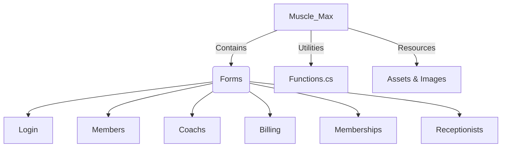

# 🏋️‍♂️ Muscle Max - Gym Management System


> **A comprehensive management solution for modern fitness centers.**

## 📖 About the Project

**Muscle Max** is a robust desktop application designed to streamline the day-to-day operations of a gym. Built with **C#** and **Windows Forms**, it provides an intuitive interface for managing members, coaches, memberships, and billing. The system is designed to be user-friendly while offering powerful administrative features to keep your gym running smoothly.

## ✨ Key Features

*   **👥 Member Management**: Easily add, update, search, and delete member records. Track personal details, membership status, and assigned coaches.
*   **🧢 Coach Management**: Manage your trainers' profiles and assign them to members.
*   **💳 Membership Plans**: Define and manage different membership tiers and pricing.
*   **💰 Billing & Payments**: Handle invoicing and track payments efficiently.
*   **👩‍💼 Receptionist Dashboard**: Dedicated portal for front-desk staff to manage daily tasks.
*   **🔒 Secure Login**: Role-based authentication system to secure sensitive data.

## 🛠️ Technology Stack

This project works with the following technologies:

| Category | Technology |
| :--- | :--- |
| **Language** |  |
| **Framework** | .NET Framework 4.7.2 |
| **UI Framework** | Windows Forms (WinForms) |
| **UI Libraries** |   |
| **Database** |  |

## 🚀 Getting Started

### Prerequisites

*   **Visual Studio** (2019 or later recommended)
*   **.NET Framework 4.7.2**
*   **Microsoft SQL Server**

### Installation

1.  **Clone the repository**
    ```bash
    git clone https://github.com/yourusername/GYM-Management-System.git
    ```
2.  **Open the project**
    *   Navigate to the project directory and open `Muscle_Max.sln` in Visual Studio.
3.  **Setup Database**
    *   Ensure your SQL Server instance is running.
    *   Configure the connection string in the application (check `Functions.cs` or `App.config` if applicable).
4.  **Run the Application**
    *   Press `F5` or click **Start** in Visual Studio to build and run the application.

## 📂 Project Structure


